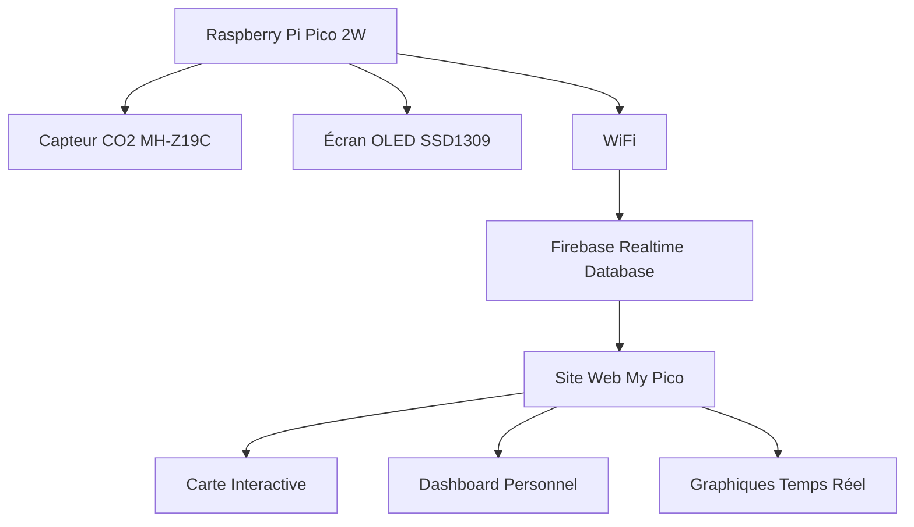

# 🌱 My Pico - Réseau de Capteurs CO2 Collaboratif

> **Projet open-source de surveillance de la qualité de l'air avec Raspberry Pi Pico 2W**

My Pico est un projet de science citoyenne qui permet à chacun de construire son propre capteur CO2 connecté et de contribuer à une cartographie collaborative de la qualité de l'air en temps réel.

  

## 🎯 Objectifs du Projet

- **🔧 DIY & Open Source** : Construire facilement son capteur CO2 avec des composants accessibles
- **📊 Données Temps Réel** : Surveillance continue avec transmission WiFi vers le cloud
- **🌍 Réseau Collaboratif** : Carte mondiale des mesures de qualité de l'air
- **📱 Interface Moderne** : Dashboard web responsive avec graphiques interactifs
- **🔔 Alertes Intelligentes** : Notifications automatiques en cas de mauvaise qualité de l'air

## 📱 Démo en Ligne

🌐 **Site Principal** : [https://noagiannone03.github.io/piCO2-project/](https://noagiannone03.github.io/piCO2-project/)

🔐 **Dashboard** : [https://noagiannone03.github.io/piCO2-project/dashboard.html](https://noagiannone03.github.io/piCO2-project/dashboard.html)

📊 **Données Détaillées** : [https://noagiannone03.github.io/piCO2-project/charts.html](https://noagiannone03.github.io/piCO2-project/charts.html)

## 🔧 Matériel Requis

### Composants Principaux

| Composant | Modèle | Prix approximatif | Fonction |
|-----------|--------|-------------------|----------|
| **Microcontrôleur** | Raspberry Pi Pico 2W | ~15€ | WiFi, traitement des données |
| **Capteur CO2** | MH-Z19C ou SCD40 | ~25-40€ | Mesure du CO2 (NDIR/optique) |
| **Écran OLED** | SSD1309 2.42" 128x64 | ~15€ | Affichage local des données |
| **Alimentation** | Micro-USB 5V 2A | ~5€ | Alimentation du système |

### Composants Secondaires

- **4-6 fils de connexion** (jumper wires femelle-femelle)
- **Breadboard ou PCB** (pour prototypage/finalisation)
- **Résistances de pull-up** 4.7kΩ (pour I2C si nécessaire)
- **Boîtier de protection** (impression 3D ou boîtier plastique)

### Coût Total : **~60-75€**

## 🔌 Schéma de Câblage Complet

```
Raspberry Pi Pico 2W        SSD1309 OLED Display        MH-Z19C CO2 Sensor
==================          ====================        ==================

3.3V    (Pin 36) ────────── VCC                         VIN (5V via VBUS)
GND     (Pin 38) ────────── GND ──────────────────────── GND
GPIO 4  (Pin 6)  ────────── SDA                         
GPIO 5  (Pin 7)  ────────── SCL                         
GPIO 0  (Pin 1)  ──────────────────────────────────────── RX (données série)
GPIO 1  (Pin 2)  ──────────────────────────────────────── TX (commandes)
VBUS    (Pin 40) ──────────────────────────────────────── VIN (5V)

Connexions I2C (Écran OLED) :
- SDA : Données bidirectionnelles
- SCL : Horloge (générée par le Pico)

Connexions UART (Capteur CO2) :
- RX/TX : Communication série (9600 baud)
- VIN : Alimentation 5V (important pour MH-Z19C)
```

## 🏗️ Architecture du Système



📋 **Pour plus de détails sur l'architecture Firebase** : [firebase-architecture.md](./firebase-architecture.md)

## 📊 Fonctionnalités

### 🔬 Surveillance Avancée
- **Mesure CO2** : Précision ±30ppm + 3% (MH-Z19C) ou ±40ppm + 5% (SCD40)
- **Fréquence** : Mesures toutes les 60 secondes
- **Calibration** : Auto-calibration sur 24h ou calibration manuelle
- **Historique** : Stockage local et cloud des données

### 📱 Interface Utilisateur
- **Écran Local** : Affichage temps réel avec interface graphique
- **Dashboard Web** : Interface responsive avec authentification
- **Graphiques Interactifs** : Chart.js pour visualisation des tendances
- **Carte Mondiale** : Leaflet.js pour géolocalisation des capteurs

### 🌐 Connectivité
- **WiFi** : Transmission automatique vers Firebase
- **Mode Hors-ligne** : Stockage local avec synchronisation différée
- **API REST** : Endpoints pour intégration tierce
- **Websockets** : Mise à jour temps réel du dashboard

### 🔔 Alertes et Notifications
- **Seuils Configurables** : Alertes personnalisées par niveau CO2
- **Notifications Push** : Via service worker (PWA)
- **Email/SMS** : Intégration possible avec services tiers
- **Codes Couleur** : Indication visuelle de la qualité de l'air

## 🚀 Installation et Configuration

### 1. Préparation du Hardware

#### Assemblage du Capteur

1. **Soudure (optionnelle)** : Pour une installation permanente
2. **Connexions** : Suivre le schéma de câblage ci-dessus
3. **Test des connexions** : Vérifier continuité avec multimètre
4. **Boîtier** : Placer dans un boîtier ventilé pour mesures précises

#### Vérification I2C/UART

```python
# Test I2C (écran OLED)
from machine import Pin, I2C
i2c = I2C(0, sda=Pin(4), scl=Pin(5), freq=400000)
devices = i2c.scan()
print("Écran OLED détecté:", [hex(d) for d in devices])

# Test UART (capteur CO2)
from machine import UART
uart = UART(0, baudrate=9600, tx=Pin(0), rx=Pin(1))
print("UART configuré pour capteur CO2")
```

### 2. Installation du Firmware

#### Option A : Firmware Pré-compilé (Recommandé)

1. **Télécharger** le firmware My Pico depuis les [releases GitHub](https://github.com/noagiannone03/piCO2-project/releases)
2. **Mode BOOTSEL** : Maintenir BOOTSEL + connecter USB
3. **Flash** : Copier le fichier `.uf2` sur le disque RPI-RP2

#### Option B : Installation Manuelle

1. **MicroPython** : Installer le firmware officiel
   ```bash
   # Télécharger depuis micropython.org
   # Raspberry Pi Pico 2W firmware
   ```

2. **Code Source** : Cloner le repository
   ```bash
   git clone https://github.com/noagiannone03/piCO2-project.git
   cd piCO2-project
   ```

3. **Transfert avec mpremote**
   ```bash
   pip install mpremote
   mpremote cp main.py :
   mpremote cp config.py :
   mpremote cp lib/ :
   ```

### 3. Configuration WiFi et Firebase

#### Fichier de Configuration

Créer `config.py` :

```python
# Configuration WiFi
WIFI_SSID = "VotreReseauWiFi"
WIFI_PASSWORD = "VotreMotDePasse"

# Configuration Firebase
FIREBASE_URL = "https://votre-projet.firebaseio.com"
FIREBASE_SECRET = "votre-secret-firebase"

# Configuration Capteur
DEVICE_ID = "pico_unique_id_001"
LOCATION_NAME = "Salon - Appartement"
LATITUDE = 48.8566
LONGITUDE = 2.3522

# Paramètres de mesure
MEASUREMENT_INTERVAL = 60  # secondes
UPLOAD_INTERVAL = 300      # secondes (5 min)
```

#### Premier Démarrage

1. **Connexion série** : Utiliser Thonny ou terminal série
2. **Configuration WiFi** : Menu interactif au premier boot
3. **Test de connexion** : Vérification Firebase et upload test
4. **Calibration CO2** : Procédure automatique (24h) ou manuelle

### 4. Accès au Dashboard

1. **Création de compte** : [Dashboard My Pico](https://noagiannone03.github.io/piCO2-project/dashboard.html)
2. **Ajout du capteur** : Saisir l'ID unique du Pico
3. **Configuration** : Nom, localisation, seuils d'alerte
4. **Visualisation** : Graphiques temps réel et historiques

## 📊 Interface Utilisateur

### Écran OLED Local

```
┌─────────────────────────┐
│  🌱 My Pico v1.0       │
│                         │
│  CO2: 847 ppm    WiFi  │
│  📊▓▓▓▓░░░  [📶]      │
│                         │
│  💚 Qualité: BONNE     │
│  📅 12:34  🔄 sync    │
└─────────────────────────┘
```

### Dashboard Web

- **📊 Graphiques interactifs** : Tendances sur 24h, 7j, 30j
- **🗺️ Carte** : Position du capteur avec données contextuelles
- **⚙️ Paramètres** : Configuration avancée, calibration
- **📱 PWA** : Installation comme app mobile
- **🔔 Alertes** : Historique et configuration des notifications

## 🔬 Comprendre les Mesures CO2

### Niveaux de Référence

| Niveau CO2 | Qualité | Couleur | Effets |
|------------|---------|---------|--------|
| < 400 ppm | Excellent | 🟢 Vert | Air extérieur normal |
| 400-600 ppm | Bon | 🔵 Bleu | Intérieur bien ventilé |
| 600-1000 ppm | Moyen | 🟡 Jaune | Début de somnolence |
| 1000-1500 ppm | Mauvais | 🟠 Orange | Fatigue, concentration réduite |
| > 1500 ppm | Dangereux | 🔴 Rouge | Maux de tête, malaise |

### Facteurs d'Influence

- **Nombre de personnes** : +100-200 ppm par personne
- **Ventilation** : Impact majeur sur les niveaux
- **Taille de la pièce** : Petit volume = accumulation rapide
- **Activité physique** : Augmente la production de CO2

## 🛠️ Maintenance et Dépannage

### Problèmes Courants

1. **Écran OLED ne s'allume pas**
   - Vérifier alimentation 3.3V
   - Tester connexions I2C (SDA/SCL)
   - Scanner I2C : `i2c.scan()`

2. **Capteur CO2 ne répond pas**
   - Vérifier alimentation 5V (VBUS)
   - Tester UART avec oscilloscope
   - Vérifier baudrate (9600)

3. **Problèmes WiFi**
   - Signal faible : rapprocher du router
   - Vérifier SSID/mot de passe
   - Redémarrer en mode configuration

4. **Données erratiques**
   - Période de chauffe : 3-5 minutes
   - Calibration requise : 24h en air libre
   - Ventilation du boîtier importante

### Logs de Diagnostic

```python
# Activer debug en série
DEBUG_MODE = True

# Logs détaillés disponibles via:
# - Interface série (115200 baud)
# - Fichier log local (log.txt)
# - Dashboard web (section diagnostics)
```

### Mise à Jour Firmware

```bash
# Via mpremote (OTA)
mpremote cp firmware_update.py :
mpremote exec "import firmware_update; firmware_update.install()"

# Ou flash complet via .uf2
```

## 🌍 Contribution au Projet

### Code Source

- **GitHub** : [https://github.com/noagiannone03/piCO2-project](https://github.com/noagiannone03/piCO2-project)
- **Issues** : Rapporter bugs et suggestions
- **Pull Requests** : Contributions bienvenues
- **Wiki** : Documentation communautaire

### Données Ouvertes

- **API publique** : Accès aux données anonymisées
- **Export CSV** : Téléchargement des mesures
- **Recherche** : Partenariats avec universités/instituts

### Communauté

- **Forum** : [Discussions GitHub](https://github.com/noagiannone03/piCO2-project/discussions)
- **Discord** : Serveur pour support temps réel
- **Newsletter** : Actualités du projet

## 📚 Ressources et Documentation

### Guides Techniques

- 📖 [Architecture Firebase détaillée](./firebase-architecture.md)
- 🔧 [Guide de construction PDF](./docs/build-guide.pdf)
- 📊 [API Documentation](./docs/api.md)
- 🎨 [Boîtiers 3D à imprimer](./hardware/3d-models/)

### Datasheets

- [Raspberry Pi Pico 2W](https://datasheets.raspberrypi.org/pico/pico-datasheet.pdf)
- [MH-Z19C CO2 Sensor](./docs/datasheets/MH-Z19C-datasheet.pdf)
- [SSD1309 OLED Display](./docs/datasheets/SSD1309-datasheet.pdf)

### Liens Utiles

- [MicroPython Documentation](https://docs.micropython.org/)
- [Firebase Setup Guide](https://firebase.google.com/docs)
- [Thonny IDE](https://thonny.org/)
- [Chart.js Documentation](https://www.chartjs.org/)

## 📄 Licence

Ce projet est sous licence **MIT** - voir le fichier [LICENSE](LICENSE) pour plus de détails.

### Utilisation Commerciale

✅ **Autorisée** avec attribution - Parfait pour :
- Projets éducatifs
- Installations institutionnelles  
- Produits commerciaux dérivés
- Recherche académique

## 🎯 Roadmap

### Version 1.1 (Q1 2024)
- [ ] Support capteur SCD40 (Sensirion)
- [ ] Mode économie d'énergie (batterie)
- [ ] Calibration automatique améliorée
- [ ] Interface mobile native

### Version 1.2 (Q2 2024)
- [ ] Capteurs additionnels (température, humidité)
- [ ] Algorithmes de prédiction IA
- [ ] Intégration Home Assistant
- [ ] API GraphQL

### Version 2.0 (Q3 2024)
- [ ] Raspberry Pi Pico 2 support
- [ ] Écran couleur TFT
- [ ] LoRaWAN pour zones sans WiFi
- [ ] Certification CE pour commercialisation

## 🆘 Support

### Support Gratuit

- **Documentation** : Wiki GitHub complet
- **Community** : Forum discussions/Discord
- **Vidéos** : Chaîne YouTube tutoriels

### Support Premium

- **Installation** : Service d'installation à domicile
- **Monitoring** : Dashboard professionnel avec SLA
- **Hardware** : Kits pré-assemblés avec garantie

📧 **Contact** : [support@mypico.org](mailto:support@mypico.org)

---

<div align="center">

**🌱 Construit avec ❤️ pour la qualité de l'air**

[Site Web](https://noagiannone03.github.io/piCO2-project/) • [Dashboard](https://noagiannone03.github.io/piCO2-project/dashboard.html) • [GitHub](https://github.com/noagiannone03/piCO2-project) • [Documentation](./docs/)

</div> 