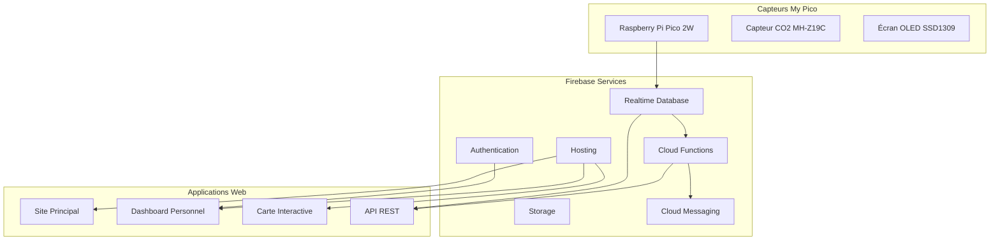

# 🔥 Architecture Firebase - My Pico

> **Guide technique détaillé de l'infrastructure cloud du projet My Pico**

## 🏗️ Vue d'ensemble de l'Architecture

My Pico utilise Firebase comme backend principal pour gérer toutes les données des capteurs CO2, l'authentification des utilisateurs et la synchronisation temps réel. Cette architecture cloud-native assure une scalabilité optimale et une expérience utilisateur fluide.



## 🔑 Services Firebase Utilisés

### 1. Firebase Realtime Database

**Fonction principale** : Stockage et synchronisation temps réel des données de capteurs

#### Structure de données

```json
{
  "sensors": {
    "pico_001": {
      "info": {
        "deviceId": "pico_001",
        "name": "Salon - Appartement",
        "location": {
          "latitude": 48.8566,
          "longitude": 2.3522,
          "address": "Paris, France"
        },
        "owner": "user123",
        "lastSeen": "2024-01-15T14:30:00Z",
        "firmware": "v1.0.3",
        "status": "online"
      },
      "measurements": {
        "2024-01-15": {
          "14:30": {
            "co2": 647,
            "temperature": 21.5,
            "humidity": 45,
            "timestamp": 1705327800,
            "quality": "good"
          },
          "14:31": {
            "co2": 652,
            "temperature": 21.6,
            "humidity": 45,
            "timestamp": 1705327860,
            "quality": "good"
          }
        }
      },
      "settings": {
        "measurementInterval": 60,
        "uploadInterval": 300,
        "alertThresholds": {
          "warning": 800,
          "danger": 1200
        },
        "calibration": {
          "lastCalibration": "2024-01-10T10:00:00Z",
          "autoCalibration": true,
          "offset": 0
        }
      }
    }
  },
  "users": {
    "user123": {
      "profile": {
        "email": "utilisateur@example.com",
        "name": "Jean Dupont",
        "createdAt": "2024-01-01T00:00:00Z",
        "preferences": {
          "language": "fr",
          "notifications": true,
          "publicData": false
        }
      },
      "sensors": ["pico_001", "pico_002"],
      "notifications": {
        "email": true,
        "push": true,
        "sms": false
      }
    }
  },
  "aggregated": {
    "global": {
      "stats": {
        "totalSensors": 1247,
        "averageCO2": 587,
        "lastUpdate": "2024-01-15T14:30:00Z"
      },
      "regions": {
        "europe": {
          "averageCO2": 542,
          "sensorCount": 234
        },
        "northamerica": {
          "averageCO2": 623,
          "sensorCount": 456
        }
      }
    }
  }
}
```

#### Règles de sécurité Firebase

```javascript
{
  "rules": {
    // Lecture publique des données agrégées
    "aggregated": {
      ".read": true,
      ".write": false
    },
    
    // Accès aux capteurs
    "sensors": {
      "$sensorId": {
        // Lecture publique des infos de base (pour la carte)
        "info": {
          ".read": true,
          ".write": "auth != null && (root.child('sensors/' + $sensorId + '/info/owner').val() == auth.uid || root.child('users/' + auth.uid + '/role').val() == 'admin')"
        },
        
        // Mesures : lecture publique si autorisée, écriture pour le propriétaire
        "measurements": {
          ".read": "root.child('sensors/' + $sensorId + '/info/owner').val() == null || root.child('users/' + root.child('sensors/' + $sensorId + '/info/owner').val() + '/preferences/publicData').val() == true || auth.uid == root.child('sensors/' + $sensorId + '/info/owner').val()",
          ".write": "auth != null && auth.uid == root.child('sensors/' + $sensorId + '/info/owner').val()"
        },
        
        // Paramètres : accès privé uniquement
        "settings": {
          ".read": "auth != null && auth.uid == root.child('sensors/' + $sensorId + '/info/owner').val()",
          ".write": "auth != null && auth.uid == root.child('sensors/' + $sensorId + '/info/owner').val()"
        }
      }
    },
    
    // Profils utilisateurs
    "users": {
      "$userId": {
        ".read": "auth != null && auth.uid == $userId",
        ".write": "auth != null && auth.uid == $userId"
      }
    }
  }
}
```

### 2. Firebase Authentication

**Fonction** : Gestion des comptes utilisateurs et authentification sécurisée

#### Méthodes d'authentification supportées

- **Email/Mot de passe** : Inscription classique
- **Google OAuth** : Connexion rapide avec compte Google
- **Apple Sign-In** : Pour les utilisateurs iOS/macOS
- **Anonyme** : Pour visualisation des données publiques

#### Configuration côté Pico

```python
# auth.py - Authentification depuis le Pico
import urequests
import ujson

class FirebaseAuth:
    def __init__(self, api_key, project_id):
        self.api_key = api_key
        self.project_id = project_id
        self.token = None
        self.refresh_token = None
    
    def authenticate_device(self, device_secret):
        """Authentification avec secret device partagé"""
        url = f"https://identitytoolkit.googleapis.com/v1/accounts:signInWithPassword?key={self.api_key}"
        
        payload = {
            "email": f"device_{device_secret}@mypico.org",
            "password": device_secret,
            "returnSecureToken": True
        }
        
        response = urequests.post(url, json=payload)
        data = response.json()
        
        if "idToken" in data:
            self.token = data["idToken"]
            self.refresh_token = data["refreshToken"]
            return True
        return False
    
    def get_auth_header(self):
        return {"Authorization": f"Bearer {self.token}"}
```

### 3. Cloud Functions

**Fonction** : Traitement automatisé des données et intégrations

#### Fonctions déployées

```javascript
// functions/index.js
const functions = require('firebase-functions');
const admin = require('firebase-admin');

admin.initializeApp();

// 1. Traitement des nouvelles mesures
exports.processMeasurement = functions.database.ref('/sensors/{sensorId}/measurements/{date}/{time}')
  .onCreate(async (snapshot, context) => {
    const measurement = snapshot.val();
    const sensorId = context.params.sensorId;
    
    // Calcul de la qualité de l'air
    const quality = calculateAirQuality(measurement.co2);
    
    // Mise à jour avec la qualité calculée
    await snapshot.ref.update({ quality });
    
    // Vérification des seuils d'alerte
    await checkAlertThresholds(sensorId, measurement);
    
    // Mise à jour des statistiques agrégées
    await updateAggregatedStats(measurement);
  });

// 2. Envoi d'alertes
exports.sendAlert = functions.database.ref('/alerts/{alertId}')
  .onCreate(async (snapshot, context) => {
    const alert = snapshot.val();
    
    // Envoi de notification push
    await sendPushNotification(alert);
    
    // Envoi d'email si configuré
    if (alert.emailEnabled) {
      await sendEmailAlert(alert);
    }
  });

// 3. Nettoyage automatique des anciennes données
exports.cleanupOldData = functions.pubsub.schedule('0 2 * * *')
  .timeZone('Europe/Paris')
  .onRun(async (context) => {
    const cutoffDate = new Date();
    cutoffDate.setDate(cutoffDate.getDate() - 90); // Garder 90 jours
    
    await cleanupMeasurements(cutoffDate);
  });

// 4. Calcul des statistiques quotidiennes
exports.calculateDailyStats = functions.pubsub.schedule('0 1 * * *')
  .timeZone('Europe/Paris')
  .onRun(async (context) => {
    await calculateDailyAggregates();
  });

// Fonctions utilitaires
function calculateAirQuality(co2) {
  if (co2 < 400) return 'excellent';
  if (co2 < 600) return 'good';
  if (co2 < 1000) return 'moderate';
  if (co2 < 1500) return 'poor';
  return 'dangerous';
}

async function checkAlertThresholds(sensorId, measurement) {
  const sensorRef = admin.database().ref(`/sensors/${sensorId}`);
  const snapshot = await sensorRef.once('value');
  const sensor = snapshot.val();
  
  const thresholds = sensor.settings.alertThresholds;
  
  if (measurement.co2 > thresholds.danger) {
    await createAlert(sensorId, 'danger', measurement);
  } else if (measurement.co2 > thresholds.warning) {
    await createAlert(sensorId, 'warning', measurement);
  }
}
```

### 4. Firebase Hosting

**Fonction** : Hébergement des applications web (site, dashboard, carte)

#### Configuration `firebase.json`

```json
{
  "hosting": {
    "public": "public",
    "ignore": [
      "firebase.json",
      "**/.*",
      "**/node_modules/**"
    ],
    "rewrites": [
      {
        "source": "/api/**",
        "function": "api"
      },
      {
        "source": "**",
        "destination": "/index.html"
      }
    ],
    "headers": [
      {
        "source": "/api/**",
        "headers": [
          {
            "key": "Access-Control-Allow-Origin",
            "value": "*"
          },
          {
            "key": "Access-Control-Allow-Methods",
            "value": "GET, POST, PUT, DELETE, OPTIONS"
          }
        ]
      }
    ]
  }
}
```

### 5. Cloud Storage

**Fonction** : Stockage des fichiers firmware, logs et exports

#### Organisation des dossiers

```
gs://mypico-project.appspot.com/
├── firmware/
│   ├── stable/
│   │   ├── v1.0.3/
│   │   │   ├── firmware.uf2
│   │   │   └── changelog.md
│   └── beta/
├── exports/
│   ├── daily/
│   └── monthly/
├── logs/
│   └── sensors/
└── avatars/
    └── users/
```

### 6. Cloud Messaging (FCM)

**Fonction** : Notifications push vers les applications web et mobiles

#### Configuration côté client

```javascript
// messaging.js
import { initializeApp } from 'firebase/app';
import { getMessaging, getToken, onMessage } from 'firebase/messaging';

const firebaseConfig = {
  // Configuration Firebase
};

const app = initializeApp(firebaseConfig);
const messaging = getMessaging(app);

// Demande de permission et récupération du token
export async function initializeMessaging() {
  try {
    const token = await getToken(messaging, {
      vapidKey: 'VOTRE_VAPID_KEY'
    });
    
    // Sauvegarder le token dans le profil utilisateur
    await saveTokenToDatabase(token);
    
    return token;
  } catch (error) {
    console.error('Erreur lors de l\'initialisation FCM:', error);
  }
}

// Écoute des messages en temps réel
onMessage(messaging, (payload) => {
  console.log('Message reçu:', payload);
  
  // Afficher la notification
  showNotification(payload.notification);
});
```

## 🔧 Configuration et Déploiement

### 1. Initialisation du projet Firebase

```bash
# Installation Firebase CLI
npm install -g firebase-tools

# Connexion à Firebase
firebase login

# Initialisation du projet
firebase init

# Services à sélectionner:
# ✅ Realtime Database
# ✅ Functions
# ✅ Hosting
# ✅ Storage
# ✅ Messaging
```

### 2. Configuration des variables d'environnement

```bash
# .env (ne pas committer!)
FIREBASE_API_KEY=your_api_key
FIREBASE_AUTH_DOMAIN=mypico-project.firebaseapp.com
FIREBASE_DATABASE_URL=https://mypico-project-default-rtdb.firebaseio.com
FIREBASE_PROJECT_ID=mypico-project
FIREBASE_STORAGE_BUCKET=mypico-project.appspot.com
FIREBASE_MESSAGING_SENDER_ID=123456789
FIREBASE_APP_ID=1:123456789:web:abcdef123456

# Secrets pour les Functions
firebase functions:config:set sendgrid.key="your_sendgrid_key"
firebase functions:config:set device.secret="your_device_auth_secret"
```

### 3. Déploiement

```bash
# Déploiement complet
firebase deploy

# Déploiement spécifique
firebase deploy --only functions
firebase deploy --only hosting
firebase deploy --only database
```

## 📊 Monitoring et Analytics

### 1. Firebase Performance Monitoring

```javascript
// performance.js
import { getPerformance } from 'firebase/performance';

const perf = getPerformance();

// Monitoring des temps de chargement
const trace = perf.trace('page_load');
trace.start();
// ... chargement de la page
trace.stop();
```

### 2. Métriques personnalisées

```javascript
// Cloud Function pour métriques
exports.recordMetrics = functions.https.onCall(async (data, context) => {
  const metrics = {
    sensorCount: await getSensorCount(),
    dailyMeasurements: await getDailyMeasurementCount(),
    averageUptime: await calculateAverageUptime()
  };
  
  // Enregistrement dans Analytics
  await admin.analytics().logEvent('daily_metrics', metrics);
  
  return metrics;
});
```

## 🔒 Sécurité et Bonnes Pratiques

### 1. Authentification des devices

```python
# Côté Pico - Authentification sécurisée
import hashlib
import time

class SecureAuth:
    def __init__(self, device_id, secret):
        self.device_id = device_id
        self.secret = secret
    
    def generate_token(self):
        timestamp = str(int(time.time()))
        message = f"{self.device_id}:{timestamp}:{self.secret}"
        token = hashlib.sha256(message.encode()).hexdigest()
        return f"{timestamp}:{token}"
    
    def authenticate(self):
        token = self.generate_token()
        # Envoi du token à Firebase pour validation
        return self.send_auth_request(token)
```

### 2. Validation côté serveur

```javascript
// Cloud Function - Validation token device
exports.validateDeviceToken = functions.https.onCall((data, context) => {
  const { deviceId, token } = data;
  
  const [timestamp, hash] = token.split(':');
  const now = Date.now() / 1000;
  
  // Vérification expiration (5 minutes max)
  if (now - parseInt(timestamp) > 300) {
    throw new functions.https.HttpsError('unauthenticated', 'Token expired');
  }
  
  // Vérification signature
  const expectedHash = crypto
    .createHash('sha256')
    .update(`${deviceId}:${timestamp}:${process.env.DEVICE_SECRET}`)
    .digest('hex');
  
  if (hash !== expectedHash) {
    throw new functions.https.HttpsError('unauthenticated', 'Invalid token');
  }
  
  return { valid: true };
});
```

### 3. Rate limiting

```javascript
// Rate limiting pour l'API
const rateLimit = new Map();

exports.rateLimitedEndpoint = functions.https.onCall((data, context) => {
  const userId = context.auth?.uid || context.rawRequest.ip;
  const now = Date.now();
  
  if (!rateLimit.has(userId)) {
    rateLimit.set(userId, { count: 1, resetTime: now + 60000 });
  } else {
    const limit = rateLimit.get(userId);
    
    if (now > limit.resetTime) {
      limit.count = 1;
      limit.resetTime = now + 60000;
    } else {
      limit.count++;
      
      if (limit.count > 100) { // 100 requêtes/minute max
        throw new functions.https.HttpsError('resource-exhausted', 'Rate limit exceeded');
      }
    }
  }
  
  // Traitement de la requête...
});
```

## 🚀 Optimisations Performance

### 1. Indexation de la base de données

```json
{
  "rules": {
    "sensors": {
      ".indexOn": ["info/lastSeen", "info/location/latitude", "info/location/longitude"]
    },
    "measurements": {
      ".indexOn": ["timestamp", "co2", "quality"]
    }
  }
}
```

### 2. Pagination des données

```javascript
// Pagination efficace des mesures
export async function getMeasurements(sensorId, limit = 100, startAfter = null) {
  let query = firebase.database()
    .ref(`sensors/${sensorId}/measurements`)
    .orderByChild('timestamp')
    .limitToLast(limit);
  
  if (startAfter) {
    query = query.endBefore(startAfter);
  }
  
  const snapshot = await query.once('value');
  return snapshot.val();
}
```

### 3. Cache intelligent

```javascript
// Service Worker pour cache offline
const CACHE_NAME = 'mypico-v1';
const CACHE_URLS = [
  '/',
  '/dashboard.html',
  '/charts.html',
  '/offline.html'
];

self.addEventListener('fetch', event => {
  event.respondWith(
    caches.match(event.request)
      .then(response => {
        // Retourner depuis le cache si disponible
        if (response) {
          return response;
        }
        
        // Sinon, requête réseau
        return fetch(event.request);
      })
  );
});
```

## 📈 Coûts et Scaling

### Estimation des coûts (pour 1000 capteurs actifs)

| Service | Usage mensuel | Coût approximatif |
|---------|---------------|-------------------|
| **Realtime Database** | 50GB stockage + 500GB transfert | ~$30 |
| **Cloud Functions** | 2M invocations | ~$10 |
| **Hosting** | 100GB bande passante | ~$15 |
| **Storage** | 10GB fichiers | ~$2 |
| **Messaging** | 100K notifications | Gratuit |
| **Authentication** | 10K utilisateurs actifs | Gratuit |
| **Total** | | **~$57/mois** |

### Stratégies d'optimisation des coûts

1. **Archivage automatique** : Déplacer les anciennes données vers Cloud Storage
2. **Compression des données** : Utiliser des formats binaires pour les mesures
3. **Cache agressif** : Réduire les lectures de base de données
4. **Batch processing** : Traiter les données par lots plutôt qu'individuellement

---

## 🔗 Liens Utiles

- 📖 [Documentation Firebase](https://firebase.google.com/docs)
- 🔧 [Firebase CLI](https://firebase.google.com/docs/cli)
- 📊 [Console Firebase](https://console.firebase.google.com)
- 🛡️ [Règles de sécurité Firebase](https://firebase.google.com/docs/rules)
- ⚡ [Cloud Functions](https://firebase.google.com/docs/functions)

---

<div align="center">

**🔥 Architecture robuste et scalable pour My Pico**

[Retour au README principal](./README.md) • [Documentation API](./docs/api.md) • [Support](mailto:support@mypico.org)

</div>